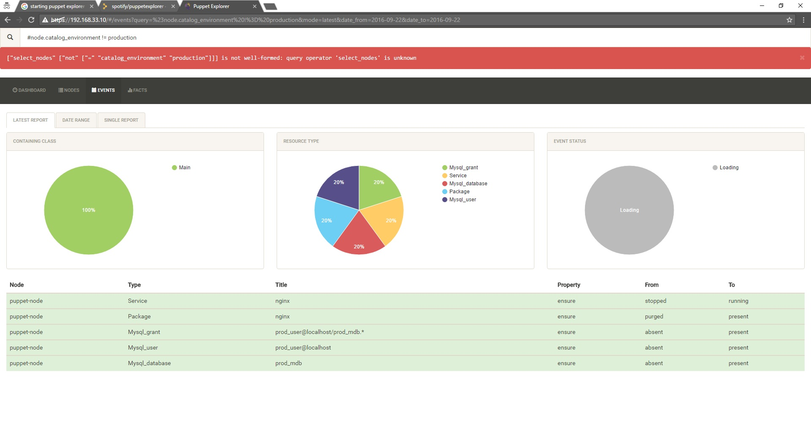
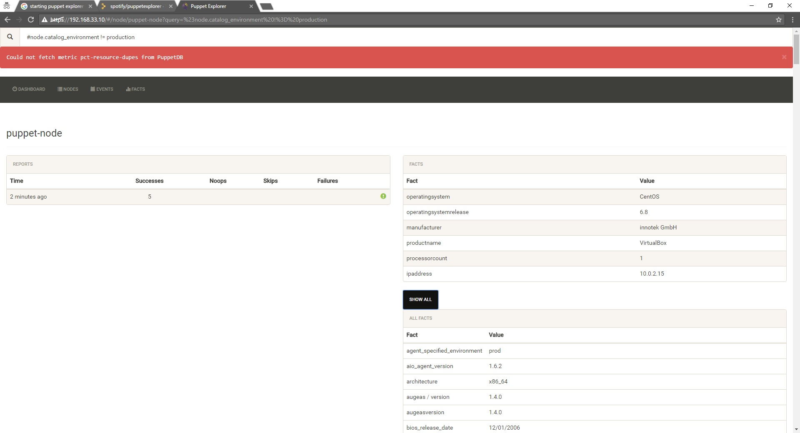

# lesson13

***Student***: [Aliaksei Khurhin](https://epa.ms/1Cqi0K)

All work was done on vagrant vm's, [Vagrantfile](Vagrantfile) with basic configuration is provided.

[Here](help.txt) is some kind of installation guide for puppetdb and pupped explorer. [Puppet config](puppet.conf) is also provided.
Prod environment is configured through [environment.conf](prod/environment.conf) file. [Manifest](prod/manifests/site.pp) or apply.
[Log](prod.log) of applying to node is provided, netstat [log](netstat.txt) is present, too.

Results in graphical form:

